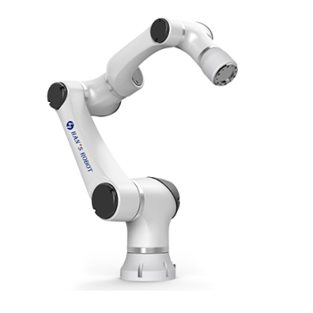

Elfin Robot
======



本文件夹中包含了多个为Elfin机器人提供ROS支持的软件包。推荐的运行环境为 Ubuntu 14.04 及 ROS Indigo，其他环境下的运行情况没有测试过。

### 安装软件包

**安装一些重要的依赖包**
```sh
$ sudo apt-get install ros-indigo-soem ros-indigo-gazebo-ros-control
```
**安装和升级MoveIt!,** 注意因为MoveIt!最新版进行了很多的优化，如果你已经安装了MoveIt!, 也请一定按照以下方法升级到最新版。

安装MoveIt!：
```sh
$ sudo apt-get install ros-indigo-moveit
$ sudo apt-get install ros-indigo-moveit-full-pr2
$ sudo apt-get install ros-indigo-moveit-kinematics
$ sudo apt-get install ros-indigo-moveit-ros-move-group
```
升级MoveIt!:
```sh
$ sudo apt-get update
$ sudo apt-get upgrade
$ sudo apt-get install ros-indigo-moveit-kinematics
$ sudo apt-get install ros-indigo-moveit-ros-move-group
```
**安装本软件包**

首先创建catkin工作空间 ([教程](http://wiki.ros.org/catkin/Tutorials))。 然后将本文件夹克隆到src/目录下，之后用catkin_make来编译。  
假设你的工作空间是~/catkin_ws，你需要运行的命令如下：
```sh
$ cd ~/catkin_ws/src
$ git clone https://github.com/hans-robot/elfin_robot.git
$ cd ..
$ catkin_make
$ source devel/setup.bash
```

---

### 使用仿真模型

用Gazebo仿真请运行：
```sh
$ roslaunch elfin_gazebo elfin3_empty_world.launch
```

运行MoveIt!模块, RViz界面:
```sh
$ roslaunch elfin3_moveit_config moveit_planning_execution.launch
```

运行后台程序及Elfin Control Panel界面：
```sh
roslaunch elfin_basic_api elfin_basic_api.launch
```

> 关于MoveIt!的使用方法可以参考[docs/moveit_plugin_tutorial.md](docs/moveit_plugin_tutorial.md)  
Tips:  
每次规划路径时，都要设置初始位置为当前位置。

如果你有手柄的话，可以运行以下程序开启手柄遥控功能：
```sh
$ roslaunch elfin3_moveit_config joystick_control.launch
```
> 关于手柄遥控的使用方法可以参考下面的链接：  
http://docs.ros.org/indigo/api/moveit_tutorials/html/doc/ros_visualization/joystick.html  
Tips:  
> 1. In the Motion Planning plugin of Rviz, enable “Allow External Comm.” checkbox in the “Planning” tab.  
> 2. Add “Pose” to rviz Displays and subscribe to /joy_pose in order to see the output from joystick. Note that only planning groups that have IK solvers for all their End Effector parent groups will work.

更多关于API的信息请看[docs/API_description.md](docs/API_description.md)

---

### 使用真实的Elfin机器人

先把购买机器人时得到的elfin_drivers.yaml放到elfin_robot_bringup/config/文件夹下。

将Elfin通过网线连接到电脑。先通过`ifconfig`指令来确定与Elfin连接的网卡名称。本软件包默认的名称是eth0 。假如当前名称不是eth0的话，请对elfin_robot_bringup/config/elfin_drivers.yaml的相应部分进行修改。
```
elfin_ethernet_name: eth0
```

加载Elfin机器人模型：
```sh
$ roslaunch elfin_robot_bringup elfin3_bringup.launch
```
启动Elfin硬件，Elfin的控制需要操作系统的实时性支持，运行下面的命令前请先为你的Linux系统内核打好实时补丁。打补丁的方法可以参考这个[教程](http://www.jianshu.com/p/8787e45a9e01)。
```sh
$ sudo chrt 10 bash
$ roslaunch elfin_robot_bringup elfin_ros_control.launch
```

运行MoveIt!模块, RViz界面:
```sh
$ roslaunch elfin3_moveit_config moveit_planning_execution.launch
```

运行后台程序及Elfin Control Panel界面：
```sh
roslaunch elfin_basic_api elfin_basic_api.launch
```

用Elfin Control Panel界面给Elfin使能指令，如果此时没有报错，直接按下"Servo On"即可使能。如果报错，需先按"Clear Fault"清错后再按下"Servo On"使能。

> 关于MoveIt!的使用方法可以参考[docs/moveit_plugin_tutorial.md](docs/moveit_plugin_tutorial.md)  
Tips:  
每次规划路径时，都要设置初始位置为当前位置。

如果你有手柄的话，可以运行以下程序开启手柄遥控功能：
```sh
$ roslaunch elfin3_moveit_config joystick_control.launch
```
> 关于手柄遥控的使用方法可以参考下面的链接：  
http://docs.ros.org/indigo/api/moveit_tutorials/html/doc/ros_visualization/joystick.html  
Tips:  
> 1. In the Motion Planning plugin of Rviz, enable “Allow External Comm.” checkbox in the “Planning” tab.   
> 2. Add “Pose” to rviz Displays and subscribe to /joy_pose in order to see the output from joystick. Note that only planning groups that have IK solvers for all their End Effector parent groups will work.

在关闭机械臂电源前，需先按下Elfin Control Panel界面的"Servo Off"给Elfin去使能。

更多关于API的信息请看[docs/API_description.md](docs/API_description.md)
